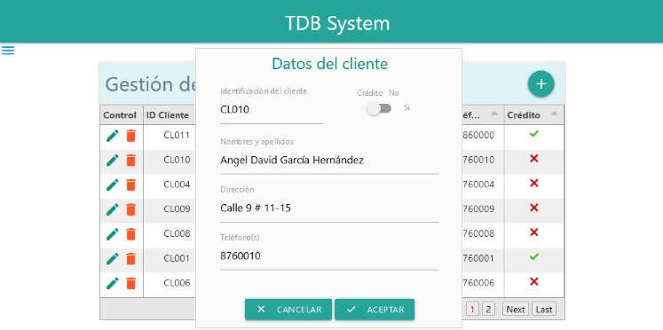

# SaleStore

Un simple ejemplo de ventas y adquisición de mercancía, **escrito en Javascript puro** y PHP, con fines académicos para mostrar:

  - Conexión a bases de datos Postgres mediante PDO.
  - Arquitectura por capas.
  - ECMAScript 2015 (ES6), ECMAScript2016 (ES2016) y ECMAScript2018 (ES8).
  - Uso de la librería [tabulator] para crear tablas interactivas sin usar jQuery.
  - Uso de [Materialize], un moderno front-end framework basado en Material Design y orientado al diseño adaptativo.



**Importante**: debe ejecutar nuevamente el script de la base de datos, luego de incorporarle sus aportes. 

### Características de la versión 0.06
  - La inserción de productos se cambia por una función almacenada en la base de datos.
  - Con la nueva función de inserción es posible conocer el ID  del nuevo producto.
  - Se agrega a Utilidades.js un objeto para traducir a español a Tabulator.
  - En main.css se modifica la clase .modal para intentar mejorar el comportamiento de los formularios.
  - Se actualizó el diagrama de la base de datos para incluir el IVA a los productos.
  - Se actualizó tdbsystem-pgscript.sql para incluir el IVA a los productos.
  - Se actualizó la vista lista_productos para incluir el iva y la columna calculada descripcion_producto.
  - Se modifica la función insertar_producto en tdbsystem-pgscript.sql.
  - Se actualiza la gestión de la tabla productos para incorporar el olvidado IVA
  - Se entrega un **prototipo JS** de lo que sería **venta**, el cual se espera que complemente.
  - Queda pendiente guardar la venta lo que se hará mendiante una funcion PGSQL.

### Características de la versión 0.05
  - Actualizado Tabulator a la versión 4.2.2
  - Se incluye en ./vista/images la representación gráfica de la base de datos utilizada
  - Se agrega a utilidades.js las funciones crearLista() y cargarLista() para agregar elementos a listas seleccionables.
  - Se corrigen inconsistencias y se agregan registros de pruebas a ./servicios/varios/tdbsystem-pgscript.sql 
  - Se incluye el CRUD de productos para mostrar la carga y edición de tablas con llaves foráneas
  - **Importante**: se agrega la vista "lista_productos" a tdbsystem-pgscript.sql. Esta vista se requiere para editar productos.
  - Otros cambios menores.

### Características de la versión 0.04
  - Se modifica la función cargarScripts() de carga-scripts.js para hacerla compatible con Mozilla Firefox.
  - Las funciones control() y acciones() de la clase Clientes.js cambian de funciones flecha a normalitas por culpa de M. Firefox.
  - La clase para el manejo de clientes deja de ser anónima y pasa a llamarse Cliente el objeto sigue siendo anónimo.
  - Se corrige ./servicios/varios/tdbsystem-pgscript.sql la relación bajas_productos <--> productos
  - se elimina el método Clientes.js::acciones() y se reemplaza por uno anónimo en la primera columna de la tabla

### Características de la versión 0.03
  - Se elimina de main.js el método gestionarClientes(), creado para pruebas en la versión 0.02
  - Se actualiza el objeto "opciones" de main.js para cargar la página que gestiona "clientes"
  - El método generarTabla() de main.js cambió para retornar el objeto Tabulator creado.
  - Ligeros cambios en main.css para mejorar la visualización de formularios
  - se agrega el parámetro clasesCSS a Util.mensaje para flexibilizar el estilo de los mensajes
  - Se reemplaza Util.getEstado() por Util.errorInfo. 
  - Util.errorInfo informa sobre errores lanzados por objetos de tipo PDO o PDOStatement
  - Se implementa la inserción de clientes desde la aplicación
  - Se implementa la eliminación de clientes desde la aplicación

### Características de la versión 0.02

  - Se agrega clientes.html y clientes.js para demostrar la carga de datos desde el back-end.
  - cliente.js incluye la creación de un objeto anónimo mediante una clase anónima.
  - Se agrega la librería [tabulator] para mostrar la información obtenida de la base de datos.
  - Se hacen pequeños ajustes a main.js para permitir la gestión de clientes.
  - carga-scripts.js permite ahora cargar además de scripts JS, módulos JS.

### Características de la versión 0.01

  - Uso de la API Fetch para acceder a datos del servidor sin necesidad de AJAX.
  - Se usa un método alternativo propio para la carga de páginas web con lo funcionalidad de jQuery load.
  - Implementación de la característica SPA (Single-Page Application) y de URL limpias o amigables.

### Dependencias

La aplicación de demostración tiene tres dependencia: *Materialize*, *IconFont* y *Tabulator* que se incluyen en la carpeta *libs* con el fin de facilitar la instalación.

### Instalación

Simplemente descargue, descomprima en la carpeta pública de un servidor de internet (XAMPP, Wamp, Lamp o cualquier otro que se le ocurra). Tenga en cuenta que esta demostración no funcionará correctamente sobre Live Server de Visual Studio Code, por razones obvias.

Se proporciona el archivo .servicios/varios/**tdbsystem-pgscript.sql** para que con base en él, cree la base de datos que se usa para el ejemplo, que por defecto se ha llamado **tdbsystem**.

También se incluye el archivo ./servicios/varios/conexion.json.**back** que deberá renombrar o guardar  como ./servicios/varios/**conexion.json**. El contenido de este archivo es:

```sh
{
    "BASE_DATOS": "tdbsystem",
    "SERVIDOR": "localhost",
    "PUERTO": "5432",
    "USUARIO": "postgres",
    "CONTRASENA": "XXXXXXXX"
}
```

Y en él deberá asignar el nombre correcto de la base de datos y demás parámetros de conexión.

Por favor tenga en cuenta que esto es una simple demostración para quienes apenas se inician en el mundo de la programación web. Siendo así son muy bienvenidas las sugerencias para mejorar este producto de demostración.

[Tabulator]: <http://tabulator.info/>
[Materialize]: <https://materializecss.com/<>